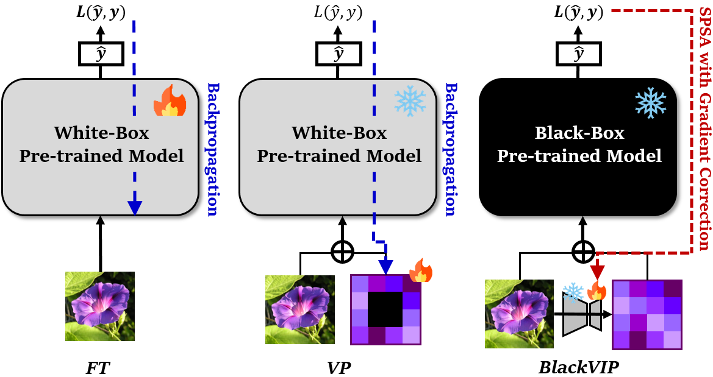
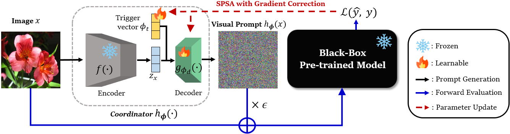

# BlackVIP: Black-Box Visual Prompting for Robust Transfer Learning
> We provide the official PyTorch Implementation of '[BlackVIP: Black-Box Visual Prompting for Robust Transfer Learning](https://arxiv.org/abs/2303.14773)' (CVPR 2023) <br/> 
>>[Changdae Oh](https://changdaeoh.github.io/), [Hyeji Hwang](https://github.com/hyezzz), [Hee-young Lee](https://github.com/hy18284), [YongTaek Lim](https://github.com/teang1995), [Geunyoung Jung](https://github.com/gyjung975), [Jiyoung Jung](https://scholar.google.co.kr/citations?user=wc_MQkoAAAAJ&hl=en), [Hosik Choi](https://scholar.google.co.kr/citations?user=0pzb3WAAAAAJ&hl=en), and [Kyungwoo Song](https://scholar.google.com/citations?user=HWxRii4AAAAJ&hl=ko)

<br/>


## Abstract
<p align="center">

</p>

> With the surge of large-scale pre-trained models (PTMs), fine-tuning these models to numerous downstream tasks becomes a crucial problem. Consequently, parameter efficient transfer learning (PETL) of large models has grasped huge attention. While recent PETL methods showcase impressive performance, they rely on optimistic assumptions: 1) the entire parameter set of a PTM is available, and 2) a sufficiently large memory capacity for the fine-tuning is equipped. However, in most real-world applications, PTMs are served as a black-box API or proprietary software without explicit parameter accessibility. Besides, it is hard to meet a large memory requirement for modern PTMs. In this work, we propose black-box visual prompting (BlackVIP), which efficiently adapts the PTMs without knowledge about model architectures and parameters. BlackVIP has two components; 1) Coordinator and 2) simultaneous perturbation stochastic approximation with gradient correction (SPSA-GC). The Coordinator designs input-dependent image-shaped visual prompts, which improves few-shot adaptation and robustness on distribution/location shift. SPSA-GC efficiently estimates the gradient of a target model to update Coordinator. Extensive experiments on 16 datasets demonstrate that BlackVIP enables robust adaptation to diverse domains without accessing PTMs' parameters, with minimal memory requirements.

<br/>

## Research Highlights
<p align="center">

</p>

* **Input-Dependent Dynamic Visual Prompting:** To our best knowledge, this is the first paper that explores the input-dependent visual prompting on black-box settings. For this, we devise `Coordinator`, which reparameterizes the prompt as an autoencoder to handle the input-dependent prompt with tiny parameters.
* **New Algorithm for Black-Box Optimization:** We propose a new zeroth-order optimization algorithm, `SPSA-GC`, that gives look-ahead corrections to the SPSA's estimated gradient resulting in boosted performance. 
* **End-to-End Black-Box Visual Prompting:** By equipping Coordinator and SPSA-GC, `BlackVIP` adapts the PTM to downstream tasks without parameter access and large memory capacity. 
* **Empirical Results:** We extensively validate BlackVIP on 16 datasets and demonstrate its effectiveness regarding _few-shot adaptability_ and _robustness on distribution/object-location shift_.

<br/>
<hr/>

## Coverage of this repository
### _Methods_
* `BlackVIP` (Ours)
* `BAR`
* `VP` (with our SPSA-GC)
* `VP`
* `Zero-Shot Inference`
### _Experiments_
* **main performance** (Tab. 2 and Tab. 3 of paper)
  * two synthetic datasets - [`Biased MNIST`, `Loc-MNIST`]
  * 14 transfer learning benchmarks - [`Caltech101`, `OxfordPets`, `StanfordCars`, `Flowers102`, `Food101`, `FGVCAircraft`, `SUN397`, `DTD`, `SVHN`, `EuroSAT`, `Resisc45`, `CLEVR`, `UCF101`, `ImageNet`]
* **ablation study** (Tab. 5 and Tab. 6 of paper)
  * varying architectures (coordinator, target model)
  * varying coordinator weights and optimizers

<br/>

## Setup
* Run the following commands to create the environment.
  * Note that we slightly modifed the [Dassl.pytorch](https://github.com/KaiyangZhou/Dassl.pytorch) to my_dassl for flexible experiments.
```shell
# Clone this repo
git clone https://github.com/changdaeoh/BlackVIP.git
cd BlackVIP

# Create a conda environment
conda create -y -n blackvip python=3.8

# Activate the environment
conda activate blackvip

# Install torch and torchvision
# Please refer to https://pytorch.org/ if you need a different cuda version
conda install pytorch==1.12.1 torchvision==0.13.1 cudatoolkit=11.6 -c pytorch -c conda-forge

# Install dependencies
cd my_dassl
pip install -r requirements.txt

# Install additional requirements
cd ..
pip install -r requirements.txt
```

<br/>

## Data preparation
* To prepare following 11 datasets (adopted by [CoOp](https://github.com/KaiyangZhou/CoOp)), please follow the instruction from https://github.com/KaiyangZhou/CoOp/blob/main/DATASETS.md
  * **Caltech101, OxfordPets, StanfordCars, Flowers102, Food101, FGVCAircraft, SUN397, DTD, EuroSAT, UCF101, and ImageNet**
  * We use the same few-shot split of **CoOp** for above 11 datasets.
* To prepare following three datasets (adopted by [VP](https://github.com/hjbahng/visual_prompting)), the instructions are below: 
  * **SVHN**:
    * Create a folder named `svhn/` under `$DATA`.
    * To download the dataset, run `BlackVIP/datasets/svhn_dl.py` after replacing the DATAPATH in 44 line as yours.
    * Download split_mlai_SVHN.json from [this link](https://drive.google.com/file/d/1dnjnMX-sr7FClb6EUywc-tNx6e1YaGpu/view?usp=sharing) and put it under `$DATA/svhn`.
  * **Resisc45**: 
    * Create a folder named `resisc45/` under `$DATA`.
    * Download `NWPU-RESISC45.rar` from https://onedrive.live.com/?authkey=%21AHHNaHIlzp%5FIXjs&id=5C5E061130630A68%21107&cid=5C5E061130630A68&parId=root&parQt=sharedby&o=OneUp and extract the file under `$DATA/resisc45`.
    * Download split_mlai_Resisc45.json from [this link](https://drive.google.com/file/d/1QTThkyN-p58hAxN7wpBntO4CncTf9qtF/view?usp=share_link) and put it under `$DATA/resisc45`.
  * **CLEVR**:
    * Download `CLEVR_v1.0.zip` from https://dl.fbaipublicfiles.com/clevr/CLEVR_v1.0.zip and extract the file under $DATA.
    * Download split_mlai_CLEVR.json from [this link](https://drive.google.com/file/d/1L4DjruSBez66W_Uezyo2mN7siDORkgeO/view?usp=share_link) and put it under `$DATA/CLEVR_v1.0`.
  * We provide fixed train/val/test splits for these three datasets to ensure reproducibility and fair comparison for future work.
* To prepare our synthetic dataset -LocMNIST-, run /datasets/mk_locmnist.py as `python mk_locmnist.py --data_root [YOUR-DATAPATH] --f_size [1 or 4]`
* For [Biased MNIST](https://github.com/clovaai/rebias), no precedures are required. 

<br/>

## Run
### transfer learning benchmarks
* Move to `BlackVIP/scripts/method_name` directory
* Across 14 benchmark datasets and four methods, you can refer [this docs](docs/configuration.md) containing the hyperparameter table
* On the targeted dataset, run the commands with dataset-specific configs as below:
```shell
# for BlackVIP, specify {1:dataset, 2:epoch, 3:moms, 4:spsa_gamma, 5:spsa_c, 6:p_eps}
sh tl_bench.sh svhn 5000 0.9 0.2 0.005 1.0

# for BAR, specify {1:dataset, 2:epoch, 3:init_lr, 4:min_lr}
sh tl_bench.sh svhn 5000 5.0 0.1

# for VP w/ SPSA-GC, specify {1:dataset, 2:epoch, 3:moms, 4:spsa_a, 5:spsa_c}
sh tl_bench.sh svhn 5000 0.9 10.0 0.01

# for VP (white-box), specify {1:dataset, 2:epoch, 3:lr}
sh tl_bench.sh svhn 1000 40.0

# for Zero-shot CLIP inference, move to 'BlackVIP/scripts/coop' and run:
sh zeroshot_all.sh
```


### synthetic datasets
* In `BlackVIP/scripts/method_name/`, there are three files to reproduce the results of Biased MNIST and Loc-MNIST: `synthetic_bm_easy.sh`, `synthetic_bm_hard.sh`, and `synthetic_lm.sh`
  * Hyperparameters are also in [this docs](docs/configuration.md).
```shell
# for BlackVIP on Loc-MNIST, specify {1:fake-digit-size, 2:moms, 3:spsa_alpha, 4:spsa_a, 5:spsa_c}
sh synthetic_lm.sh 1 0.9 0.5 0.01 0.005  # 1:1 setting
sh synthetic_lm.sh 4 0.95 0.5 0.02 0.01  # 1:4 seeting

# for BlackVIP on Biased MNIST, specify {1:moms, 2:spsa_alpha, 3:spsa_a, 4:spsa_c}
sh synthetic_bm_easy.sh 0.9 0.4 0.01 0.01  # spurious correlation = 0.8
sh synthetic_bm_hard.sh 0.9 0.4 0.01 0.01  # spurious correlation = 0.9

# other methods can be runned similarly to the above.
```

### ablation study
```shell
# for BlackVIP, specify {1:target_backbone, 2:spsa_alpha, 3:moms, 4:spsa_gamma, 5:spsa_c, 6:p_eps}
sh ablation_arch_rn.sh rn50 0.5 0.9 0.2 0.01 0.3
```

<br/>
<hr />

## Contact
For any questions, discussions, and proposals, please contact to `changdae.oh@uos.ac.kr` or `kyungwoo.song@gmail.com`

<br/>

## Citation
If you use our code in your research, please kindly consider citing:
```bibtex
@InProceedings{Oh_2023_CVPR,
    author    = {Oh, Changdae and Hwang, Hyeji and Lee, Hee-young and Lim, YongTaek and Jung, Geunyoung and Jung, Jiyoung and Choi, Hosik and Song, Kyungwoo},
    title     = {BlackVIP: Black-Box Visual Prompting for Robust Transfer Learning},
    booktitle = {Proceedings of the IEEE/CVF Conference on Computer Vision and Pattern Recognition (CVPR)},
    month     = {June},
    year      = {2023},
    pages     = {24224-24235}
}
```

<br/>

## Acknowledgements
Our overall experimental pipeline is based on [CoOp, CoCoOp](https://github.com/KaiyangZhou/CoOp) repository. For baseline construction, we bollowed/refered the code from repositories of [VP](https://github.com/hjbahng/visual_prompting), [BAR](https://github.com/yunyuntsai/Black-box-Adversarial-Reprogramming), and [AR](https://github.com/savan77/Adversarial-Reprogramming). We appreciate the authors (Zhou et al., Bahng et al., Tsai et al.) and Savan for sharing their code.

